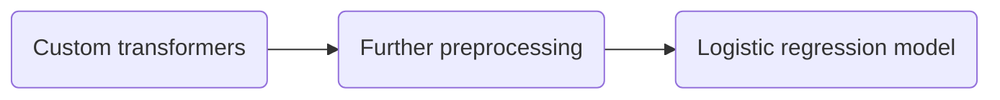

## About
Sunshine Hotels in Singapore wants to formulate policies to reduce expenses incurred due to no-shows. They requested use of analytics on over 100,000 customer records to understand behaviour of past no-shows and predict future no-shows. Both problem statement and dataset belong to AI Singapore's AI Apprenticeship Programme (AIAP(R))'s technical assessment past-year series.

## Contents
Base folder contains
> Folder `src`
> 
> `requirements.txt` file
> 
> Bash script `run.sh`
> 
> Jupyter notebook `eda.ipynb`

Folder `src` contains
> Folder `data`
> `CustomTransformers.py` file
> `Preprocess.py` file
> `ModelPipeline.py` file

Folder `data` contains
>  Dataset `noshow.db`

`CustomTransformers.py` and `Preprocess.py` are imported and executed in `ModelPipeline.py`, which contains the machine learning pipeline to predict no-shows. `ModelPipeline.py` is executed via `run.sh`. Please refer to `eda.ipynb` for a full exploratory data analysis.

## Instructions
Here is a demonstration on how to create a virtual environment for Python 3 and execute `run.sh` in Bash. First install the `python3-venv` package that contains the `venv` module. 
```bash
$ sudo apt install python3-venv
```
You can switch to a directory where you prefer to store your virtual environment using Bash command `cd`. Place `run.sh`, `requirements.txt` and folder `src` in the same directory.
```bash
$ cd /path/to/directory
```
Create your virtual environment and name it `my-project-env`.
```bash
$ python3 -m venv my-project-env
```
Activate your virtual environment. 
```bash
$ source my-project-env/bin/activate
```
Once activated, the shell prompt should display the name of your virtual environment in brackets. Install required Python 3 packages found in `requirements.txt`.
```bash
(my-project-env) $ pip install -r requirements.txt
```
Now execute `run.sh`. 
```bash
(my-project-env) $ ./run.sh
```
Navigate to folder `src` and you should see output `evaluation_report.txt`.

Deactivate the virtual environment to return to your normal shell.
```bash
(my-project-env) $ deactivate
```

## Dataset `noshow.db`
It contains 119,391 records and 15 columns.

| Column | Non-Null Count | Dtype | Example Values |
|--|--|--|--|
| booking_id | 119391 | int64 | 66947
| no_show | 119390 | float64 | 1.0
| branch | 119390 | object | Orchard
| booking_month | 119390 | object | September
| arrival_month | 119390 | object | October, OctOber, OctobeR
| arrival_day | 119390 | float64 | 15.0
| checkout_month | 119390 | object | November
| checkout_day | 119390 | float64 | 3.0, -3.0
| country | 119390 | object | China
| first_time | object | object | Yes
| room | 97778 | object | Single
| price | 94509 | object | USD$ 665.37, SGD$ 937.55
| platform | 119930 | object | Website
| num_adults | 119930 | object | 1, one
| num_children | 119930 | float64 | 0.0

## Methodology
Prediction of no-shows is a binary classification problem. There are only two possible classes, 0 (showed up) or 1 (no-show). 

Dataset is imbalanced in favour of class 0 (63% of records). If the dataset is not rebalanced before being ingested in the pipeline, the resulting model may be better at predicting the majority class than minority class.

> Solution: Down-sample (resample) the majority class to yield 44,224 samples to match the number of minority class records, and then upweight the majority class by creating a new column of weights. Newly balanced dataset should have 88,448 records in total.

> Example: 
> No. of records (minority class) = 200
> No. of records (majority class) = 300
> Total no. of records = 500
> Original weight (majority class) = 300 / 500 = 0.6
> Down-sampling factor (majority class) = 300 / 200 = 1.5
> Upweight (majority class) = 0.6 * 1.5 = 0.9
> Upweight (minority class) = 0 --- *there should not be weight assigned to minority class*

After randomly shuffling the dataset to minimise bias, setting feature and target `no_show` variables, the dataset undergoes a train-test split with 0.2 test size.

> x_train.shape: (70758, 15)
> y_train.shape: (70758, 1)
> x_test.shape: (17690, 15)
> y_test.shape: (17690, 1)

Next we define the pipeline. Pipeline has 3 main steps:

Step 1: Custom transformers
> Selected features that have anomalies but are necessary for creation of new features are cleaned. New features `arrival_month_no`, `booking_month_no`, `checkout_month_no`, `months_stayed`, `nights_stayed` and `price_per_night` are created. Categorical features `branch` and `country` are encoded.

Step 2: Further preprocessing
> Non-essential features are removed, and the final 7 features undergo Z-score normalisation due to varying scales. Here is a summary of treatments:

| Feature | Treatment | Dtype |
|--|--|--|
| booking_id | Removed | int64 |
| branch | Encoded, normalised | float64^ |
| booking_month | Removed | object |
| arrival_month | Removed | object |
| arrival_day | Removed | float64 |
| checkout_month | Removed | object |
| checkout_day | Removed | float64 |
| country | Encoded, normalised | float64^ |
| first_time | Removed | object |
| room | Removed | object |
| price | Removed | float64^ |
| platform | Removed | object | 
| num_adults | Removed | object |
| num_children | Removed | float64 |
| weight* | Normalised | float64 |
| arrival_month_no* | Normalised | float64 |
| booking_month_no* | Normalised | float64 |
| checkout_month_no* | Removed | float64 |
| months_stayed* | Removed | float64 |
| nights_stayed* | Normalised | float64 | 
| price_per_night* | Normalised | float64 |

*created,  not in original dataset
^original dtype was *object* before transformation

Updated shapes:
> x_train.shape: (70758, 7)
> y_train.shape: (70758, 1)
> x_test.shape: (17690, 7)
> y_test.shape: (17690, 1)

Step 3: Logistic regression model
> Prediction of no-shows can be treated as a probability problem that requires output of binary values. Logistic regression is an efficient mechanism for calculating probabilities and was used as the model.

After execution of the pipeline, predictions made on test data are evaluated on a set of metrics: accuracy score, F1 score and log loss, and output to `evaluation_report.txt`. 

Logistic regression is suited to predicting both classes due to high accuracy, high precision, high recall and low log loss.

|Evaluation Metric |Result|
|--|--|
|Accuracy Score|1.0|
|F1 Score|1.0|
|Log Loss|0.00014|

## Methodology Support
Here are more explanations of features chosen. Please refer to `eda.ipynb` for the full exploratory data analysis.

Feature `branch`
> 66.4% of all bookings was for the Changi branch. When bookings were isolated to no-shows, the percentage jumped to 74.9%.

Feature `country`
> 40.7% of all bookings was from Chinese customers. When bookings were isolated to no-shows, the percentage jumped to 62.2%.

Feature `arrival_month_no`
> Most no-shows were observed to arrive between April and August based on `arrival_month`. `arrival_month_no` is a numerical representation of `arrival_month` in order to be fed into the model.
>
> Example:
> January: 1.0
> February: 2.0
> March: 3.0
> ...
> November: 11.0
> December: 12.0

Feature `booking_month_no`
> Most no-shows were observed to be from bookings made in June and September based on `booking_month`. `booking_month_no` is a numerical representation of `booking_month` in order to be fed into the model.

Feature `nights_stayed`
> `months_stayed`, `arrival_month`, `arrival_day` and `checkout_day` are used to derive `nights_stayed`. `months_stayed` is derived from `checkout_month_no` - `arrival_month_no`, which are numerical representations of `arrival_month` and `checkout_month`.
>
> Due to the absence of a date column in the dataset, `nights_stayed` is inferred. For example, if `months_stayed` is 1.0, and `arrival_month` is January, then `nights_stayed` = `checkout_day` - `arrival_day` + 31 days.
>
> Generally, the longer the stay, the less no-shows observed. It could be due to longer stays being planned in advance, with stronger intent.

Feature `price_per_night`
> `nights_stayed` and `price` are used to derive `price_per_night`, which is closer to how hotels charge and a fairer indication of intent. For example, a customer with an SGD 1,000 booking for 5 nights is different from a customer with an SGD 1,000 booking for 2 nights since their average price per night differs. Customers whose bookings were SGD 750-1000 in total, or SGD 375-500 and SGD 875-1000 per night were observed to most likely no-show.
>
> `price` needs special attention due to two different currencies, SGD and USD, present in non-null values, and null values present. USD is converted to SGD, and null values are imputed with the median price of all non-null bookings. Imputation is preferred over removal of rows to preserve other non-null feature values.

Feature `weight`
> Please refer to the section on rebalancing the dataset.

